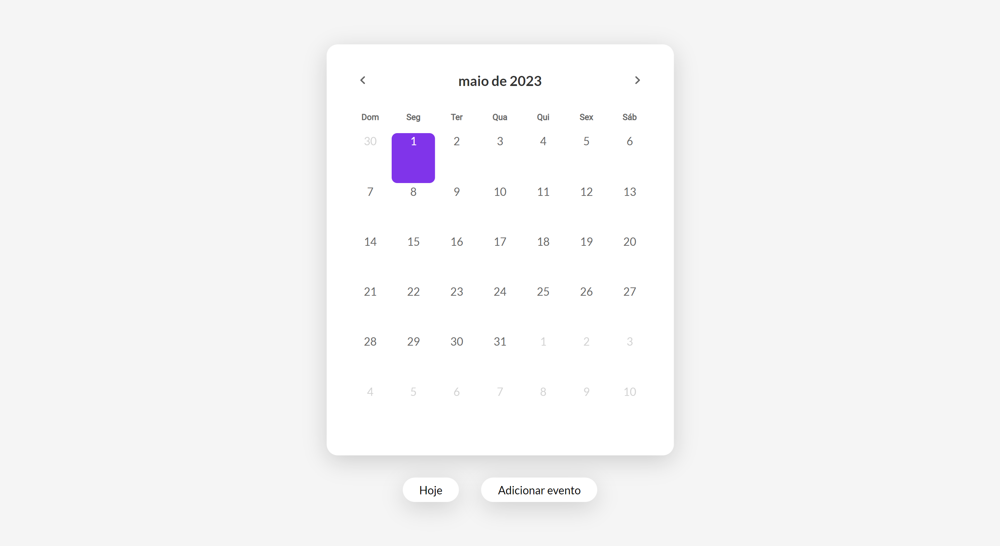

<h1 align="center"> Date Picker - BoraCodar#17 </h1>

[Clique aqui para acessar](https://maik-emanoel.github.io/date-picker/)

## 🚀 Tecnologias

Esse projeto foi desenvolvido com as seguintes tecnologias:

- HTML
- CSS
- JavaScript
- Biblioteca [FullCalendar](https://fullcalendar.io/)
- Git and GitHub

## 💻 Projeto

Um date picker é um componente de interface de usuário que permite ao usuário selecionar uma data a partir de um calendário interativo. 

Projeto construído a partir do layout proposto no desafio [#BoraCodar17](https://boracodar.dev/) realizado pela [Rocketseat](https://rocketseat.com.br).
Após o desenvolvimento do projeto inicial, adicionei novas features, tais quais:

- Layout responsivo (Adaptado para telas menores);
- Opção de adicionar eventos;
- Eventos são arrastáveis e redimensionáveis;
- Botão que volta para a data atual;
- Animações/efeitos hover;
- Entre outras pequenas modificações.

## 🔖 Layout

Você pode visualizar o layout do projeto proposto através [DESSE LINK](https://www.figma.com/community/file/1233047894822880766). É necessário ter conta no [Figma](https://figma.com) para acessá-lo.